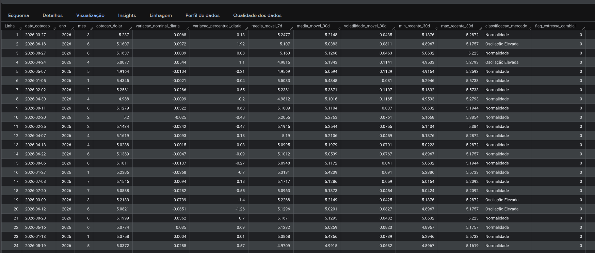
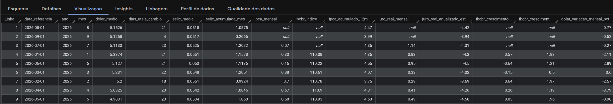

# 📊 Pipeline de Engenharia de Dados & Análise Macroeconômica — Banco Central do Brasil (BCB)


-F38020.svg)


-gold.svg)

Pipeline de dados automatizado de ponta a ponta (ELT) que extrai indicadores macroeconômicos da API do Banco Central do Brasil (SGS), realiza armazenamento e higienização em formato Parquet no Cloudflare R2, carrega as tabelas brutas no Google Cloud BigQuery e orquestra transformações analíticas avançadas via dbt para geração de KPIs financeiros.

---

## Indicadores Monitorados

O pipeline consolida os quatro principais pilares da macroeconomia brasileira:
* **Taxa Selic**: Taxa básica de juros da economia (série diária e meta anualizada).
* **Cotação do Dólar (USD/BRL)**: Cotação comercial diária de fechamento.
* **IPCA**: Índice Nacional de Preços ao Consumidor Amplo (inflação oficial mensal).
* **IBC-Br**: Índice de Atividade Econômica do Banco Central (prévia mensal do PIB).

---

## 🎯 Casos de Uso & Perguntas de Negócio 

A modelagem analítica na camada Gold foi projetada para apoiar decisões estratégicas de investimento e risco macroeconômico, respondendo diretamente às seguintes questões de negócio:

### 1. Visão Geral e Indicadores Atuais
* **Selic Atual:** Qual foi a última taxa Selic cadastrada e qual o valor médio acumulado nos últimos 30 dias?
* **Cotação Atual do Dólar:** Qual é o valor mais recente do Dólar (PTAX) e quais foram as cotações máxima e mínima registradas no mês corrente?
* **Inflação Recente:** Qual foi o IPCA do último mês divulgado e qual é a inflação acumulada nos últimos 12 meses?

### 2. Tendências e Médias Móveis
* **Média Móvel do Dólar:** Qual é o comportamento das médias móveis de 7 e 30 dias do Dólar PTAX para suavizar oscilações pontuais de mercado?
* **Trajetória da Selic:** A taxa de juros básica apresenta tendência de alta, estabilidade ou afrouxamento monetário nos últimos 6 meses?

### 3. Cruzamento de Indicadores & Métricas Avançadas
* **Juros Reais (Selic vs. IPCA):** Descontando a inflação (IPCA acumulado em 12 meses) da Selic acumulada no mesmo período, qual foi a taxa real de retorno obtida?
* **Atividade Econômica vs. Política Monetária:** Qual é a correlação histórica entre os ciclos de aperto monetário (alta da Selic) e a desaceleração do índice de atividade econômica (IBC-Br)?
* **Repasse Cambial (*Pass-Through*):** Choques de desvalorização cambial (alta súbita do Dólar) geram impactos diretos na inflação oficial do mês subsequente?

### 4. Análise de Risco, Volatilidade & Anomalias
* **Dias de Estresse Cambial:** Identificação dos pregões históricos com variação positiva diária do Dólar superior a **+2,0%** (indicador de estresse ou evento de aversão a risco).
* **Picos Históricos de Inflação:** Identificação dos 5 meses com maior aceleração inflacionária em todo o período histórico para testes de sensibilidade.

---

## 🏗️ Arquitetura da Solução


O fluxo de dados segue o padrão moderno de arquitetura em medalhão (*Medallion Architecture*):
* **Camada Bronze (Raw):** Ingestão dos payloads brutos em JSON da API do BCB direto para o **Cloudflare R2**.
* **Camada Silver (Clean/Structured):** Higienização de schemas, tipagem e conversão para arquivos colunares Parquet particionados no R2, com posterior carga no **Google BigQuery** (staging).
* **Camada Gold (Analytics):** Modelagem dimensional in-warehouse usando **dbt Core** com métricas agregadas e testes de integridade.
* **Orquestração:** O **Apache Airflow** gerencia o fluxo de ponta a ponta, disparando as tarefas de extração, upload e execução dos modelos dbt.
* **Isolamento de Ambiente:** Toda a stack (Airflow Webserver, Scheduler, Postgres de metadados) roda conteinerizada via **Docker Compose**.

---

## 📊 Resultados & Validação no Data Warehouse (Camada Gold)

Abaixo estão as visualizações das tabelas analíticas materializadas diretamente no **Google BigQuery**, comprovando o funcionamento ponta a ponta das transformações e regras de negócio orquestradas via dbt:

### 1. Fato de Câmbio Diário (`gold.fct_cambio_diario`)
Consolidação diária contendo médias móveis de 7 e 30 dias, cálculo de volatilidade histórica móvel, bandas de suporte/resistência e classificação automatizada de estresse de mercado:




### 2. Fato Macroeconômica Mensal (`gold.fct_macroeconomia_mensal`)
Consolidação na granularidade mensal unificando os 4 indicadores do BCB para análise macroeconômica. A tabela cruza o retorno acumulado da Selic com a inflação oficial (IPCA) para apuração de juros reais e traz o índice de atividade econômica (IBC-Br) com métricas de crescimento MoM e YoY:



> *Nota Técnica:* Os registros com valores nulos nos meses mais recentes de indicadores como IPCA e IBC-Br refletem com precisão o atraso (*lag*) oficial de divulgação dos órgãos emissores (IBGE e Banco Central), evidenciando o tratamento correto de junções com séries temporais de periodicidades distintas (diária vs. mensal).
---

## Desenvolvimento Local & Validação Exploratória

Antes da orquestração automatizada no Cloudflare R2 e BigQuery, o ciclo de vida dos dados passou por uma etapa de *data profiling* e validação estrutural em ambiente local:

1. **Exploração e Engenharia de Features nos Notebooks (`notebooks/`):**
   * Avaliação de distribuições, detecção de sazonalidade e análise de valores nulos nos 4 indicadores (`exploracao_dolar.ipynb`, `exploracao_selic.ipynb`, etc.).
   * Prototipagem das regras de negócio (cálculo de médias móveis, juros reais e lógica de preenchimento/alinhamento de datas).

2. **Simulação Local do Data Lake (`data/bronze` e `data/silver`):**
   * **Camada Bronze Local:** Teste de consumo da API do BCB salvando respostas brutas para verificar estabilidade de payloads.
   * **Camada Silver Local:** Validação prática de eficiência de compressão e tipagem convertendo os dados para arquivos binários `.parquet` com esquemas estritos via PyArrow antes do deploy do script final de upload.


---

## 📁 Estrutura do Projeto.

```text
Pipeline_BCB/
├── config/                  # Configurações globais e paths do projeto
│   └── settings.py
├── dags/                    # DAGs de orquestração do Apache Airflow
│   └── dag_pipeline_bcb.py
├── data/                    # Storage local para testes de profiling e validação (ignorado no Git)
│   ├── bronze/              # Carga inicial em formato bruto (JSON/raw) via API
│   │   ├── dolar/
│   │   ├── ibcbr/
│   │   ├── ipca/
│   │   └── selic/
│   └── silver/              # Prototipagem da tipagem e compressão em formato Parquet
│       ├── dolar_silver_test.parquet
│       ├── ibcbr_silver_test.parquet
│       ├── ipca_silver_test.parquet
│       └── selic_silver_test.parquet
├── dbt_bcb/                 # Projeto de transformação analítica (dbt)
│   ├── models/
│   │   └── gold/
│   │       ├── sources.yml               # Mapeamento das tabelas staging da camada Silver
│   │       ├── fct_cambio_diario.sql     # Fato diária: médias móveis, retorno e volatilidade
│   │       └── fct_macroeconomia_mensal.sql # Fato mensal: juros reais, IPCA 12m, MoM e YoY
│   └── dbt_project.yml
├── docs/                    # Documentação e artefatos visuais
│   └── assets/
│       ├── architecture_pipeline_bcb.png
│       └── bigquery_gold_fct_cambio.png
├── notebooks/               # Análise exploratória inicial e profiling de dados
│   ├── exploracao_dolar.ipynb
│   ├── exploracao_ibcbr.ipynb
│   ├── exploracao_ipca.ipynb
│   └── exploracao_selic.ipynb
├── src/                     # Módulos Python de ingestão e carga em nuvem
│   ├── __init__.py
│   ├── extract_data.py      # Extração da API do BCB -> Cloudflare R2 (Bronze)
│   ├── transformation_data.py # Limpeza, tipagem e conversão para Parquet (Silver no R2)
│   └── load_data.py         # Carga Silver (R2) -> Google Cloud BigQuery (stg_*)
├── test/                    # Testes unitários dos módulos de ingestão
│   └── test_extract.py
├── .env.example             # Template das variáveis de ambiente necessárias
├── .gitignore               # Regras de segurança (chaves GCP, .env real e pasta data/)
├── docker-compose.yml       # Orquestração dos serviços (Airflow Webserver, Scheduler, Postgres)
├── Dockerfile               # Imagem customizada com dependências do dbt e Python
├── requirements.txt         # Dependências do projeto Python
└── README.md                # Documentação técnica da solução
```


  ### 1. Pré-requisitos
  * Docker e Docker Compose instalados
  * Contas no Cloudflare R2 e Google Cloud

  ### 2. Execução
  ```bash
  git clone [https://github.com/MatheussRiibeiro/Pipeline_BCB.git](https://github.com/MatheussRiibeiro/Pipeline_BCB.git)
  cd Pipeline_BCB
  cp .env.example .env
  docker compose up -d