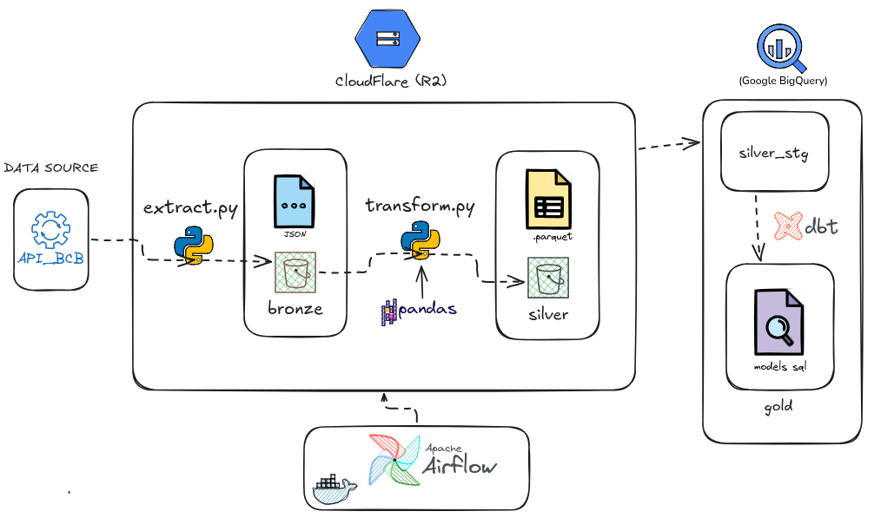

# 📊 Pipeline de Engenharia de Dados & Análise Macroeconômica — Banco Central do Brasil (BCB)

## 🏗️ Arquitetura da Solução


-F38020.svg)


-gold.svg)

Pipeline de dados automatizado de ponta a ponta (ELT) que extrai indicadores macroeconômicos da API do Banco Central do Brasil (SGS), realiza armazenamento e higienização em formato Parquet no Cloudflare R2, carrega as tabelas brutas no Google Cloud BigQuery e orquestra transformações analíticas avançadas via dbt para geração de KPIs financeiros.

---

## 📌 Indicadores Monitorados

O pipeline consolida os quatro principais pilares da macroeconomia brasileira:
* **Taxa Selic**: Taxa básica de juros da economia (série diária e meta anualizada).
* **Cotação do Dólar (USD/BRL)**: Cotação comercial diária de fechamento.
* **IPCA**: Índice Nacional de Preços ao Consumidor Amplo (inflação oficial mensal).
* **IBC-Br**: Índice de Atividade Econômica do Banco Central (prévia mensal do PIB).

---

## 🏗️ Arquitetura da Solução


O fluxo de dados segue o padrão moderno de arquitetura em medalhão (*Medallion Architecture*)


## 🔬 Desenvolvimento Local & Validação Exploratória

Antes da orquestração automatizada no Cloudflare R2 e BigQuery, o ciclo de vida dos dados passou por uma etapa de *data profiling* e validação estrutural em ambiente local:

1. **Exploração e Engenharia de Features nos Notebooks (`notebooks/`):**
   * Avaliação de distribuições, detecção de sazonalidade e análise de valores nulos nos 4 indicadores (`exploracao_dolar.ipynb`, `exploracao_selic.ipynb`, etc.).
   * Prototipagem das regras de negócio (cálculo de médias móveis, juros reais e lógica de preenchimento/alinhamento de datas).

2. **Simulação Local do Data Lake (`data/bronze` e `data/silver`):**
   * **Camada Bronze Local:** Teste de consumo da API do BCB salvando respostas brutas para verificar estabilidade de payloads.
   * **Camada Silver Local:** Validação prática de eficiência de compressão e tipagem convertendo os dados para arquivos binários `.parquet` com esquemas estritos via PyArrow antes do deploy do script final de upload.

> *Nota: Os diretórios e arquivos de dados brutos (`data/` e `*.parquet`) são intencionalmente gerenciados via `.gitignore` para seguir as boas práticas de não versionamento de dados pesados e temporários no repositório de código.*

* **Orquestração:** O **Apache Airflow** gerencia o fluxo de ponta a ponta, coordenando as tarefas de extração, upload para o R2, disparo de jobs de carga no BigQuery e compilação/execução dos modelos dbt.
* **Isolamento de Ambiente:** Toda a stack (Airflow Webserver, Scheduler, Postgres de metadados) roda conteinerizada via **Docker Compose**.

---

## 📁 Estrutura do Projeto

```text
Pipeline_BCB/
├── config/                  # Configurações globais e paths do projeto
│   └── settings.py
├── dags/                    # DAGs de orquestração do Apache Airflow
│   └── dag_pipeline_bcb.py
├── data/                    # Storage local para testes de profiling e validação (ignorado no Git)
│   ├── bronze/              # Carga inicial em formato bruto (JSON/raw) via API
│   │   ├── dolar/
│   │   ├── ibcbr/
│   │   ├── ipca/
│   │   └── selic/
│   └── silver/              # Prototipagem da tipagem e compressão em formato Parquet
│       ├── dolar_silver_test.parquet
│       ├── ibcbr_silver_test.parquet
│       ├── ipca_silver_test.parquet
│       └── selic_silver_test.parquet
├── dbt_bcb/                 # Projeto de transformação analítica (dbt)
│   ├── models/
│   │   └── gold/
│   │       ├── sources.yml               # Mapeamento das tabelas staging da camada Silver
│   │       ├── fct_cambio_diario.sql     # Fato diária: médias móveis, retorno e volatilidade
│   │       └── fct_macroeconomia_mensal.sql # Fato mensal: juros reais, IPCA 12m, MoM e YoY
│   └── dbt_project.yml
├── notebooks/               # Análise exploratória inicial e profiling de dados
│   ├── exploracao_dolar.ipynb
│   ├── exploracao_ibcbr.ipynb
│   ├── exploracao_ipca.ipynb
│   └── exploracao_selic.ipynb
├── src/                     # Módulos Python de ingestão e carga em nuvem
│   ├── __init__.py
│   ├── extract_data.py      # Extração da API do BCB -> Cloudflare R2 (Bronze)
│   ├── transformation_data.py # Limpeza, tipagem e conversão para Parquet (Silver no R2)
│   └── load_data.py         # Carga Silver (R2) -> Google Cloud BigQuery (stg_*)
├── test/                    # Testes unitários dos módulos de ingestão
│   └── test_extract.py
├── .env.example             # Template das variáveis de ambiente necessárias
├── .gitignore               # Regras de segurança (chaves GCP, .env real e pasta data/)
├── docker-compose.yml       # Orquestração dos serviços (Airflow Webserver, Scheduler, Postgres)
├── Dockerfile               # Imagem customizada com dependências do dbt e Python
├── requirements.txt         # Dependências do projeto Python
└── README.md                # Documentação técnica da solução